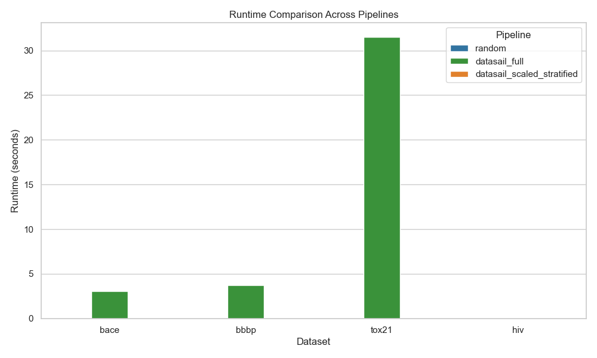

# Scaling DataSAIL to Large Datasets

[](https://github.com/KashishMendiratta/DataSAIL_scaling/actions/workflows/ci.yml)
[](https://www.python.org/)

Master's thesis project investigating how to scale [DataSAIL](https://doi.org/10.1038/s41467-025-58606-8), a general-purpose framework for leakage-aware dataset splitting, to large datasets (10k–100k+ samples), where full pairwise similarity computation and ILP optimization become computationally impractical. This implementation is currently evaluated on four molecular machine-learning benchmarks; generalization to other data modalities has not yet been verified.

The project proposes a hybrid approximation: run DataSAIL on a representative subset of the data, then extend the resulting splits to the remaining samples using a **balance-aware k-nearest-neighbour assignment** strategy.

**Supervised by** Roman Joeres and Prof. Dr. Olga Kalinina, Saarland University / HIPS.

---

## Key Result

Across BACE, BBBP, Tox21, and HIV (MoleculeNet benchmarks), the scaled approximation preserved most of full DataSAIL's leakage-reduction behavior while scaling to datasets where full DataSAIL was computationally impractical:

| Dataset | Full DataSAIL runtime | Scaled DataSAIL runtime | Notes |
|---|---:|---:|---|
| BACE (~1.5k) | 3.1s | 5.8s | overhead dominates on small data |
| BBBP (~2k) | 3.8s | 6.3s | overhead dominates on small data |
| Tox21 (~8k) | 31.5s | 21.9s | 1.44x speedup |
| HIV (~41k) | ~1800s (est.) | 298.0s | full DataSAIL impractical at this scale |

Leakage fraction (test molecules with a near-duplicate in train, similarity > 0.7) dropped substantially vs. random splitting across all datasets. For example, BACE dropped from 84.9% (random) → 7.3% (full DataSAIL) → 1.2–4.1% (scaled). See [`reports/MASTER REPORT.pdf`](reports/MASTER%20REPORT.pdf) for the full leakage, split-quality, and downstream ML performance analysis (Accuracy, F1, MCC, ROC-AUC, and PR-AUC using Random Forest and Logistic Regression classifiers).

**Balanced kNN assignment was a necessary addition, not an optional refinement**: naive nearest-neighbour propagation caused runaway train-split dominance (up to ±14.5 percentage-point deviation from target ratios on BBBP), since unassigned molecules statistically favor neighbours in the largest existing partition. The balance-aware correction reduced the maximum deviation to approximately 0.5 percentage points or less in the final four-dataset evaluation.



---

## Project Structure
```text
Data-SAIL_scaling/
├── data/
│   ├── raw/moleculenet/          # bace.csv, bbbp.csv, tox21.csv, hiv.csv
│   ├── sampled/                  # downsampled subsets
│   ├── processed/                # intermediate DataSAIL input files
│   └── temp/                     # temporary pipeline files
│
├── src/
│   ├── downsampling/
│   │   └── strategies.py         # random_downsample, stratified_downsample, diversity_downsample
│   ├── assignment/
│   │   ├── knn_assignment.py     # naive kNN assignment (majority/weighted/closest)
│   │   └── balanced_knn.py       # balanced kNN assignment (similarity x balance_weight)
│   └── utils.py                  # fingerprints, split saving, deviation metrics
│
├── experiments/
│   ├── pipelines/
│   │   ├── run_datasail_full.py            # full DataSAIL (reference / baseline)
│   │   ├── run_random_pipeline.py          # random train/val/test split (baseline)
│   │   ├── run_datasail_scaled_naive.py    # downsample + naive kNN assignment
│   │   ├── run_datasail_scaled_random.py   # random downsampling + balanced kNN
│   │   └── run_datasail_scaled_stratified.py  # stratified downsampling + balanced kNN (proposed method)
│   │
│   ├── analysis/
│   │   ├── run_leakage_evaluation.py              # mean train-test similarity across splits
│   │   ├── run_nn_leakage.py                      # nearest-neighbour leakage + leakage fraction
│   │   ├── run_ml_evaluation_extended.py          # downstream ML eval (RF/LogReg): accuracy, F1, MCC, AUC, precision, recall, PR-AUC
│   │   ├── aggregate_extended_tox21_results.py    # aggregate ML results (mean/std) across Tox21's 12 labels
│   │   ├── compute_distribution_ratio_error.py    # Distribution Ratio Error (DRE) per split
│   │   ├── compute_kl_divergence.py               # KL divergence, split vs. original label distribution
│   │   ├── compute_pairwise_similarity_preservation.py  # structural representativeness of subsets
│   │   ├── runtime_scaled_vs_datasailfull.py      # runtime + speedup comparison (full vs. scaled)
│   │   ├── plot_results.py                        # ML performance plots (MCC, AUC vs PR-AUC, etc.)
│   │   ├── plot_pipeline_analysis.py              # runtime, leakage-vs-runtime, split-quality plots
│   │   └── archive/                               # earlier iterations, kept for history; not used in final results
│   │       ├── run_ml_evaluation.py               # superseded by run_ml_evaluation_extended.py
│   │       ├── aggregate_tox21_results.py         # superseded by aggregate_extended_tox21_results.py
│   │       ├── distribution_gap_comparison.py     # superseded by compute_distribution_ratio_error.py
│   │       └── runtime_random_vs_stratified.py    # superseded by runtime_scaled_vs_datasailfull.py
│   │
│   ├── dataset_tests/
│   │   └── test_pipeline_bbbp.py
│   │
│   ├── dataset_download/
│   │   ├── download_bace.py
│   │   ├── download_bbbp.py
│   │   ├── download_more_datasets.py
│   │   └── download_tox21_fix.py
│   │
│   ├── algorithm_tests/
│   │   ├── test_downsampling.py
│   │   ├── test_knn_assignment.py
│   │   └── test_balanced_assignment.py
│   │
│   └── utils/
│       └── verify_split_distributions.py
│
├── results/
│   ├── experiments/<dataset>/    # per-dataset splits, runtime logs, split statistics
│   └── analysis/                 # aggregated CSVs (leakage, DRE, KL divergence, ML results) + plots/
│
├── reports/                      # complete project report
├── tests/                        # deterministic unit tests for core algorithms
├── environment.yml              # complete research environment
├── pyproject.toml                # lightweight package and CI dependencies
└── README.md
```

> Scripts under `experiments/analysis/archive/` are earlier drafts superseded by the versions listed above them (either extended with more metrics, or fixed after a stale split-folder naming bug). Kept for development history; use the non-archived versions for reproducing results.

---

## Setup

For the complete research environment:

```bash
conda env create -f environment.yml
conda activate datasail-scale
```

For the lightweight core package and its tests:

```bash
python -m venv .venv
source .venv/bin/activate
python -m pip install -e ".[test]"
pytest -q
```

---

## Running the Pipeline

**Baselines:**
```bash
python experiments/pipelines/run_datasail_full.py        # full DataSAIL, per-dataset ILP optimization
python experiments/pipelines/run_random_pipeline.py      # random split, no leakage awareness
```

**Scaled approximation:**
```bash
# naive kNN assignment (demonstrates train-split dominance failure mode)
python experiments/pipelines/run_datasail_scaled_naive.py

# balanced kNN assignment, random downsampling
python experiments/pipelines/run_datasail_scaled_random.py

# balanced kNN assignment, stratified downsampling (proposed method; best results on imbalanced datasets)
python experiments/pipelines/run_datasail_scaled_stratified.py
```

Each script iterates over `["bace", "bbbp", "tox21", "hiv"]` with dataset-specific handling (`run_datasail_full.py` currently covers `bace/bbbp/tox21`; HIV requires the scaled approach due to runtime). Outputs, including ML-ready splits, runtime logs, and split statistics, are saved to `results/experiments/<dataset>/`.

Default parameters: 25% representative subset size, k=5 nearest neighbours, balance_weight (λ) = 2, target split ratios 70/20/10.

---

## Running the Analysis

Once splits are generated (`results/experiments/splits/<dataset>/<split_type>/{train,val,test}.csv`), run the evaluation scripts from `experiments/analysis/`:

```bash
# Leakage metrics
python experiments/analysis/run_leakage_evaluation.py       # mean train-test similarity
python experiments/analysis/run_nn_leakage.py                # nearest-neighbour leakage + leakage fraction

# Split quality
python experiments/analysis/compute_distribution_ratio_error.py
python experiments/analysis/compute_kl_divergence.py
python experiments/analysis/compute_pairwise_similarity_preservation.py

# Downstream ML performance
python experiments/analysis/run_ml_evaluation_extended.py
python experiments/analysis/aggregate_extended_tox21_results.py

# Runtime
python experiments/analysis/runtime_scaled_vs_datasailfull.py

# Plots (run after the above)
python experiments/analysis/plot_pipeline_analysis.py
python experiments/analysis/plot_results.py
```

All outputs are written to `results/analysis/` (CSVs) and `results/analysis/plots/` (figures).

---

## Methodology Summary

1. **Downsample** the dataset (random or stratified, 25% by default) to a representative subset.
2. **Run DataSAIL** on the subset only. Similarity computation and ILP optimization scale quadratically with dataset size, so restricting this step to the subset is what makes the approach tractable.
3. **Assign remaining molecules** to train/val/test using balanced kNN: for each unassigned molecule, retrieve k nearest neighbours (Jaccard similarity on ECFP/Morgan fingerprints, radius=2, 2048 bits via RDKit), score each candidate split by similarity × balance-correction factor, and assign to the highest-scoring split. The balance factor penalizes already-oversized splits and boosts underrepresented ones, which is what prevents the train-dominance failure seen under naive nearest-neighbour propagation.

Full derivation, complexity analysis (O(k² + (n−k)·K) vs. O(n²) for full DataSAIL), and evaluation framework (leakage metrics, split-quality metrics, downstream ML performance) are in [`reports/MASTER REPORT.pdf`](reports/MASTER%20REPORT.pdf).

---

## Datasets

From [MoleculeNet](https://doi.org/10.1039/c7sc02664a):

| Dataset | Size | Task |
|---|---|---|
| BACE | ~1.5k | binary classification |
| BBBP | ~2k | binary classification |
| Tox21 | ~8k | multi-task toxicity |
| HIV | ~41k | activity prediction |

---

## Status

Research prototype with preliminary single-run results (`seed=42`). The central scaling result is promising, but it should not be interpreted as a statistically replicated benchmark. See the report's conclusion and future-work section for planned extensions, including repeated runs, larger datasets, dynamic tuning of `k`, and evaluation with D-MPNN models.
